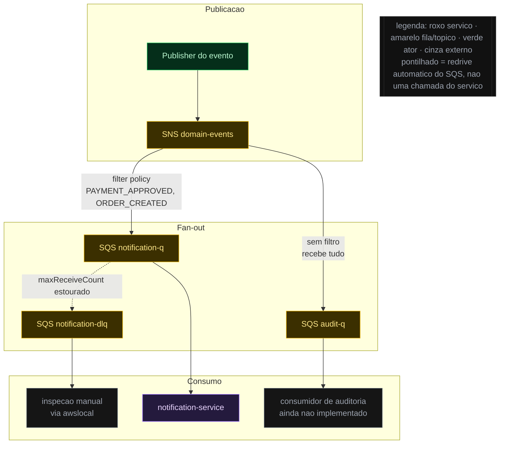

# Diagramas Mermaid

Esta skill é sobre **o desenho**, não sobre o arquivo que o contém. O formato do arquivo de um
desenho (frontmatter, tipos, `meta.json`) está em `drawing-writing`.

## O renderer que vai desenhar isto

A Specs Platform renderiza com **Mermaid 11.17**, `theme: 'dark'`, layout **dagre** (o padrão),
fonte Inter, e estas `themeVariables`:

| variável | valor |
|---|---|
| `background` | `#1f1f1f` |
| `primaryColor` | `#986dff` (roxo do accent) |
| `primaryTextColor` | `#f9fafb` |
| `primaryBorderColor` | `#2a2a2a` |
| `lineColor` | `#6b7280` |
| `secondaryColor` | `#151515` |
| `tertiaryColor` | `#111111` |

Consequências práticas, todas verificadas neste repositório:

- **Fundo é escuro.** Toda cor que você escolher precisa contrastar com `#1f1f1f`. Preencher com
  `#fff` ou usar texto `#000` sem `fill` explícito produz um bloco ilegível.
- **`layout: elk` NÃO está disponível.** O pacote `@mermaid-js/layout-elk` não está instalado; um
  bloco que pede elk falha no render e a página mostra "Erro no diagrama Mermaid". Use dagre —
  ou seja, não declare `layout` nenhum.
- **`securityLevel` é o padrão (`strict`).** `<br/>` funciona em rótulos; HTML arbitrário, não.
  Não conte com `click`/callbacks.
- Todo bloco ```mermaid vira um card com **zoom e pan em tela cheia**. Um diagrama que não cabe na
  largura da página não é um problema fatal — mas ainda é um diagrama ruim se só se lê no zoom.

## Escolha do tipo de diagrama

Escolha pelo **tipo de pergunta**, não pelo que é mais bonito:

| A pergunta é... | Use |
|---|---|
| Que peças existem e quem fala com quem? | `flowchart` com `subgraph` por camada |
| Em que ordem as coisas acontecem, e quem espera por quem? | `sequenceDiagram` |
| Em que estados uma entidade pode estar e o que a move? | `stateDiagram-v2` |
| Como os dados se relacionam? | `erDiagram` (tabelas) ou `classDiagram` (objetos) |
| Onde estão as fronteiras de sistema/infra? | `flowchart` com subgraphs nomeados pela fronteira |

`flowchart` resolve a grande maioria. Prefira-o a `architecture-beta`, `C4Context`, `journey`,
`mindmap` e afins: são mais frágeis, menos familiares e rendem pior no tema escuro. Só use um
deles quando o `flowchart` genuinamente não expressa a ideia — e diga na legenda por quê.

## Layout: como não produzir um diagrama largo demais

- **`flowchart TB` no topo, `direction LR` dentro de cada `subgraph`.** Faixas horizontais
  empilhadas rendem um diagrama equilibrado; `LR` puro no topo produz diagramas larguíssimos que
  só se leem com scroll horizontal.
- **Nunca ligue uma aresta a um `subgraph` inteiro.** Ligue sempre a um nó específico: uma aresta
  apontando para o subgraph faz o Mermaid **ignorar o `direction` interno dele** — é a causa nº 1
  de "por que meu diagrama ficou torto".
- **Máximo ~15 nós por diagrama.** Passou disso, o problema não é o diagrama: é o recorte. Quebre
  em dois blocos ```mermaid — um panorâmico e um de detalhe — em vez de espremer tudo.
- Agrupe por **camada, fronteira ou etapa** — o que fizer o leitor achar a peça que procura.
- Prefira poucos tipos de seta. `-->` para o caminho normal, `-.->` para o assíncrono/eventual,
  `==>` para o caminho crítico. Três significados já é bastante; documente-os na legenda.

## Cor: a paleta do tema escuro

Use `classDef` — nunca `style` inline nó a nó, que é impossível de manter. Duas paletas,
dependendo do que o desenho está dizendo.

**Desenho de mudança** (o que esta task/feature vai mexer) — mesma paleta das specs:

```
  classDef changed fill:#3b2f00,stroke:#eab308,color:#fde68a
  classDef added fill:#052e1a,stroke:#22c55e,color:#bbf7d0
  classDef removed fill:#3b0d0d,stroke:#ef4444,color:#fecaca
  classDef untouched fill:#151515,stroke:#2a2a2a,color:#9ca3af
```

Legenda: `> 🟡 alterado · 🟢 adicionado · 🔴 removido · ⚪ inalterado (contexto)`

**Desenho de arquitetura** (como o sistema é, sem noção de mudança):

```
  classDef service fill:#241a3d,stroke:#986dff,color:#e9d5ff
  classDef store fill:#0b2a3d,stroke:#38bdf8,color:#bae6fd
  classDef queue fill:#3b2f00,stroke:#eab308,color:#fde68a
  classDef external fill:#151515,stroke:#4b5563,color:#9ca3af
  classDef actor fill:#052e1a,stroke:#22c55e,color:#bbf7d0
```

Legenda: `> 🟣 serviço · 🔵 armazenamento · 🟡 fila/tópico · 🟢 ator · ⚪ externo`

Regras que valem para as duas:

- **A cor precisa significar uma coisa só** — natureza da mudança **ou** natureza do componente,
  nunca as duas no mesmo desenho.
- **Toda paleta usada vira legenda.** Diagrama colorido sem legenda é decoração.
- Aplique com `:::classe` no nó (`SQS[notification-q]:::queue`) ou com `class A,B,C queue` no fim.
  Escolha um dos dois estilos e mantenha no arquivo inteiro.

### Onde a legenda mora

Depende de onde o diagrama está:

- **Em `.specs/drawings/`** — a página renderiza **só o diagrama**, então a legenda tem de estar
  **dentro dele**, como um nó solto sem arestas:

  ```
    leg[[legenda: roxo servico · amarelo fila/topico · verde ator · cinza externo<br/>pontilhado = redrive automatico, nao uma chamada]]:::legend
    classDef legend fill:#111111,stroke:#2a2a2a,color:#9ca3af
  ```

  Sem aresta ligando o nó de legenda a nada — o dagre o encosta num canto livre, que é onde ele
  deve ficar. Evite acentos e `·` colados em pontuação problemática dentro do rótulo.

- **Em specs e discoveries** — o markdown em volta é renderizado, então a legenda é uma linha de
  citação logo abaixo do bloco:
  `> 🟡 alterado · 🟢 adicionado · 🔴 removido · ⚪ inalterado (contexto)`

## Rótulos

- **Um nó por recurso real** — fila, tabela, use case, endpoint, serviço, job. Nada de "o backend"
  ou "a camada de dados": se não dá para apontar no repositório, o nó não ajuda ninguém.
- Nomeie pelo **nome real do recurso** (`notification-q`, `ProcessEventService`,
  `dev.samir.notification.adapter.out.dynamodb`), não por uma paráfrase.
- **Sem aspas duplas dentro do rótulo.** Quando precisar de caractere problemático (`(`, `)`, `:`,
  `,`, `#`), envolva o rótulo inteiro em aspas duplas: `A["POST /v1/notifications (async)"]`.
  Para uma aspa literal, use a entidade `#quot;`.
- **`<br/>` para quebrar linha**, nunca `\n`.
- Duas linhas por rótulo é o teto. A terceira linha vira texto abaixo do diagrama.
- IDs de nó em `camelCase` ou `kebab-case` curtos e estáveis (`snsTopic`, `notif-q`). Evite `end`
  como id — é palavra reservada e quebra o parser.

## Antes de gravar: a checklist que evita o card vermelho

1. Todo `subgraph` tem `end`.
2. Nenhuma aresta aponta para um `subgraph` (só para nós).
3. Todo `classDef` declarado é usado, e todo `:::classe` referencia um `classDef` existente.
4. Nenhum rótulo tem aspas duplas soltas nem `\n`.
5. Não há `layout:` no frontmatter do diagrama.
6. Contagem de nós ≤ 15.
7. A legenda existe — nó `:::legend` dentro do diagrama num desenho, linha de citação abaixo do
   bloco numa spec ou discovery.

Se puder, valide de fato antes de entregar:

```bash
npx -y @mermaid-js/mermaid-cli -i <arquivo>.md -o /tmp/check.svg
```

Se o mmdc não estiver disponível, diga que a validação foi só a checklist — não afirme que
renderizou.

## Exemplo completo (arquivo de `.specs/drawings/`)

````markdown
---
title: "Fan-out do SNS domain-events"
type: architecture
date: 2026-09-01
---


````

Repare no que **não** está no arquivo: nenhum parágrafo, nenhuma seção, nenhum título no corpo.
Todo o significado está nos rótulos dos nós e das arestas.
