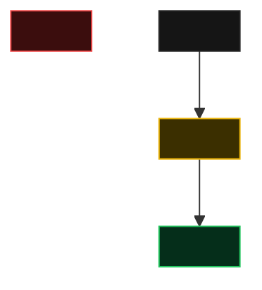

## Contexto da alteração

<Por que esta task existe: como funciona hoje, o que passa a funcionar diferente e o que o
usuário percebe (ou não percebe). 2 a 4 parágrafos curtos, sem detalhe de implementação.>

**Depende de:**

- [<Título da task>](./feat-<slug>-<task>.md) — <o que ela entrega para esta>

## Visão Técnica

> 🟡 alterado · 🟢 adicionado · 🔴 removido · ⚪ inalterado (contexto)

### O que muda, em resumo

| # | Mudança | Efeito |
|---|---------|--------|
| 1 | <mudança> | <efeito prático> |

### Detalhamento técnico

<Recorte 1 — ex: Endpoint, Regra de negócio, Persistência>

<Explicação do recorte seguida dos critérios de aceite verificáveis dele.>

- [ ] ...

Segurança e sanitização de inputs

- [ ] ...

Testes

- [ ] ...

## Escopo

- ...

### Fora de escopo

- ...

## Code Review Checklist

- [ ] ...
