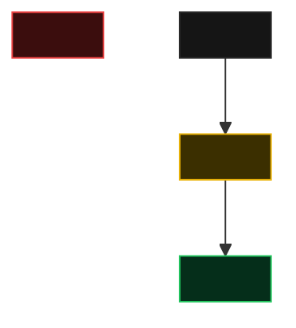

## Contexto da alteração

<Por que esta task existe: qual tela/fluxo existe hoje, o que passa a existir e o que o usuário
ganha com isso. 2 a 4 parágrafos curtos, sem detalhe de implementação.>

**Depende de:**

- [<Título da task>](./feat-<slug>-<task>.md) — <o que ela entrega para esta>

## Visão Técnica

> 🟡 alterado · 🟢 adicionado · 🔴 removido · ⚪ inalterado (contexto)

### O que muda, em resumo

| # | Mudança | Efeito |
|---|---------|--------|
| 1 | <mudança> | <efeito prático para o usuário> |

### Detalhamento técnico

<Seção/componente 1>

<Estrutura, hierarquia e comportamento + critérios de aceite.>

- [ ] ...

Responsividade (Desktop · Tablet · Mobile)

- [ ] ...

Estados de UI — loading, erro, vazio

- [ ] ...

Acessibilidade e animações

- [ ] ...

Testes E2E

- [ ] ...

## Escopo

- ...

### Fora de escopo

- ...

## Code Review Checklist

- [ ] ...
