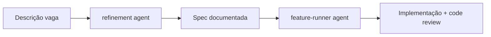

Bem-vindo à **Specs Platform**! Este arquivo demonstra como suas specs são renderizadas na UI local.

## Onde editar

Todo o conteúdo de specs vive em `.specs/specs/`. A estrutura é:

```
.specs/
├── config.json          # configuração da plataforma
└── specs/
    ├── meta.json        # lista das features (slugs na ordem desejada)
    ├── _templates/      # templates de tasks (backend, frontend, integração)
    └── <slug-da-feature>/
        ├── meta.json    # título, descrição, ícone, tasks
        └── feat-<slug>-<task>.md
```

## Como adicionar sua primeira feature

1. Crie uma pasta em `.specs/specs/<slug-da-feature>/`.
2. Adicione um `meta.json`:
   ```json
   {
     "title": "Minha feature",
     "description": "Uma linha descrevendo o escopo.",
     "icon": "rocket",
     "pages": ["feat-minha-feature-backend"]
   }
   ```
3. Crie os arquivos de task seguindo o padrão `feat-<slug>-<nome>.md`. Use os templates em `_templates/` como ponto de partida.
4. Adicione o slug da pasta em `.specs/specs/meta.json` para que a feature apareça na sidebar.

## Checklist de boas-vindas

- [x] Specs Platform instalada (`specs install`)
- [x] Configuração inicial em `.specs/config.json`
- [x] Esta feature de exemplo renderizando
- [ ] Você cria sua primeira feature real
- [ ] Você remove esta feature exemplo

## Recursos da UI

- **Drag-and-drop na sidebar** — reordena features e tasks (persiste nos `meta.json`).
- **Modal "Alterar Status"** — muda `status: pending|in-progress|completed` no frontmatter sem sair da UI.
- **Botão "Rodar Tarefa"** — dispara o agent `feature-runner` em um novo terminal, com prompt pronto.
- **Título sem duplicação** — o `title` do frontmatter já vira o `<h1>` da página; não repita um
  `# Título` no corpo do markdown (se repetir, a UI remove o duplicado).
- **Blocos expansíveis** — use `<details>` + `<summary>` para esconder detalhamento técnico longo:

<details>
<summary>Exemplo de bloco expansível</summary>

O conteúdo aqui dentro é markdown normal — listas, tabelas, código e checkboxes funcionam.

- [ ] deixe uma linha em branco depois do `</summary>` e antes do `</details>`

</details>

- **Renderizador Markdown** — suporta GFM, tabelas, code highlight e Mermaid (clique no diagrama
  ou no ícone de expandir para abrir em tela cheia com zoom e pan):



## Próximos passos

Quando terminar de explorar:

- Remova esta feature: `rm -rf .specs/specs/exemplo` e remova o slug `"exemplo"` de `.specs/specs/meta.json`.
- Peça ao Claude: **"refine a feature <X>"** para iniciar seu primeiro refinamento com o agent `refinement`.
- Depois: **"executa a feature <X>"** e o agent `feature-runner` cuida da implementação.
