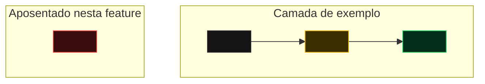

## O que será feito

Este arquivo é o **overview da feature**: mora em `.specs/specs/<slug>/overview.md` e é renderizado
na rota `/features/<slug>`. Se ele não existir, a plataforma continua redirecionando para a
primeira task — nada quebra.

Use este espaço para a **visão macro**: o problema, a decisão tomada e o desenho geral da solução.
O detalhe de cada recorte vive nas tasks.

## Visão Técnica

O diagrama do overview mostra a arquitetura macro da feature inteira; o diagrama de cada task
mostra o recorte micro daquela task. Ambos usam as mesmas cores.

> 🟡 alterado · 🟢 adicionado · 🔴 removido · ⚪ inalterado (contexto)

### Ordem de execução

Descreva a cadeia crítica entre as tasks — o que bloqueia o quê e o que pode andar em paralelo.
A lista de tasks com status aparece automaticamente abaixo desta página.
